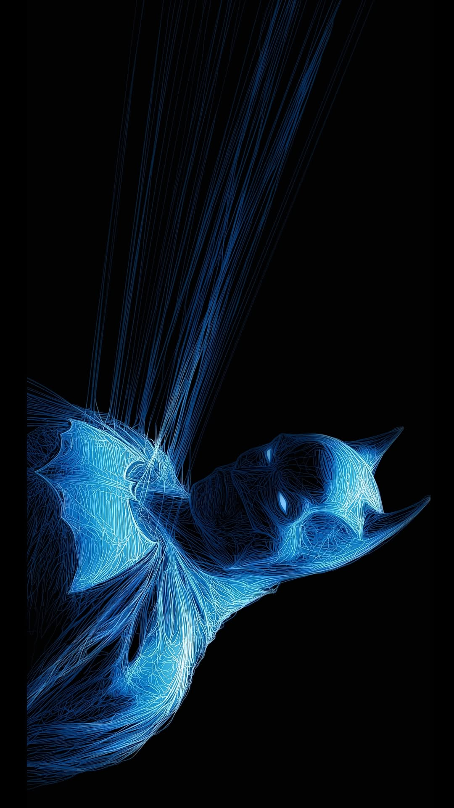

# 🦇 ABHAY RUDATALA - THE CODE CRUSADER 🦇

<div align="center">

<p align="center">
 
</p>
### *"It's not who I am underneath, but what I do that defines me"*
#### - Christopher Nolan's Batman

---

**🌃 MCA Student GLS University 🌃**

**💻 Full Stack Developer in Training | AI/ML Enthusiast 💻**

</div>

---

## 🦇 ABOUT THE DARK KNIGHT

```
Name: Abhay Rudatala
Status: MCA Student (Class of 2025)
Base of Operations: GLS University
Mission: To protect Gotham's digital infrastructure through code
```

<div align="center">


</div>

---

## ⚡ ARSENAL OF SKILLS

### 🗡️ **Programming Languages**
<div align="center">


</div>

### 🛡️ **Frameworks & Technologies**
<div align="center">


</div>

### 🏢 **Databases**
<div align="center">


</div>

### 🔧 **Development Tools**
<div align="center">


</div>

---

## 🌟 MISSION COMPLETED (PROJECTS)

### 🏗️ **Resume Builder** 
> *"Every great hero needs a great origin story"*

**Tech Stack:** MERN (MongoDB, Express.js, React, Node.js)
- Comprehensive resume building platform
- Full-stack web application
- User-friendly interface for professional resume creation
- Demonstrates end-to-end development skills

<div align="center">

```
🦇 More projects brewing in the Batcave... 🦇
```

</div>

---

## 🎯 CURRENT FOCUS

<div align="center">

### 🤖 **AI/ML Specialization**
*Exploring the future of technology through Artificial Intelligence and Machine Learning*


</div>

---

## 🌙 BEYOND THE CODE

<div align="center">

### 🎨 **Creative Pursuits**
- **🎨 Drawing & Sketching** - *Creating visual stories*
- **📚 Reading Books** - *Expanding knowledge horizons*
- **🎵 Listening to Music** - *Finding rhythm in code*

</div>

---

## 📬 CONTACT THE DARK KNIGHT

<div align="center">

### 🦇 **Bat-Signal Activated** 🦇

[](mailto:abhayrudatala56789@gmail.com)
[](https://www.linkedin.com/in/abhay-rudatala-/)
[](https://github.com/Abhay-Rudatala)

</div>

---

<div align="center">

### 🌃 **"The night is darkest just before the dawn"** 🌃

```
 ▄▀█ █▄▄ █░█ ▄▀█ █▄█   █▀█ █░█ █▀▄ ▄▀█ ▀█▀ ▄▀█ █░░ ▄▀█
 █▀█ █▄█ █▀█ █▀█ ░█░   █▀▄ █▄█ █▄▀ █▀█ ░█░ █▀█ █▄▄ █▀█
```

**MCA Student | Class of 2025 | GLS University**

*Building tomorrow's solutions with today's code*

</div>

---

<div align="center">


**⭐ Star this repository if you find it interesting! ⭐**

</div>
